# Context management strategy

Keeping the agent's *active* context high-signal — fighting **context rot**, the
slow accumulation of stale tool output, superseded plans, and resolved errors that
dilutes attention long before the hard token limit. Three mechanisms maintain one
protected thing — the active window — and a telemetry loop makes its health
measurable rather than guessed.

## 1. Externalize state — keep the window thin

Durable state lives *outside* the window: `SPEC.md` / `TASKS.md` (ephemeral build
memory), `ARCHITECTURE.md` + ADRs (durable), and issue state on GitHub. The window
holds only the current slice/issue's working set. Heavy, iterative work (reviews,
test generation, triage, reading deploy logs) runs in **subagents** — their
intermediate tokens never enter the main thread; only the verdict returns. Hold
**pointers, not payloads**: reference a path and let a subagent read it, rather than
pasting file contents or tool dumps into the main thread.

## 2. Compact at seams — proactively

Auto-compact is reactive and can thrash (a large tool output refills the window
right after a summarize). Compact instead at **seams** where state is already
persisted, so reclaiming the window costs almost nothing:

- each slice/issue close (after `/auto-commit`, with `TASKS.md` updated);
- after `harden` (spec frozen) and after `code-verifier` APPROVE (diff frozen).

Mid-unit exception: if utilization passes ~60% off a seam, checkpoint to `TASKS.md`
and compact early rather than letting auto-compact hit mid-edit. Keep it **focused**
(the *Compact Instructions* block in `CLAUDE.md`): always preserve the `TASKS.md`
pointer, current acceptance criteria, modified files, and open findings; drop the
noise. Never compact across a gate whose verdict isn't recorded first.

## 3. Surface instructions just-in-time, in layers

- `CLAUDE.md` — always-on, tiny: the gates only, stable and volatile-free (protects
  the cached prefix).
- Skill bodies — load only when invoked; the skill *description* is the retrieval
  index. Rules surface at the decision point that needs them (`auto-commit`'s
  secret scan at commit time, not at session start where they'd rot).
- Survives compaction: because each rule lives in its skill, invoking the skill
  *re-surfaces* its rules even after the conversation that first loaded them was
  summarized away. Front-loaded instructions rot; JIT-loaded ones don't. This is why
  "rules live in the skill, don't restate in `CLAUDE.md`" is a context-health
  feature, not just DRY.

## The feedback loop

The telemetry layer is the sensor: a falling cache read-rate or rising fresh-input
tokens per turn (`hooks/cache-meter.sh` inline + the OpenTelemetry dashboards in
`observability/`) signals the prefix is churning or the window is bloating — the cue
to compact or trim at the next seam. Sense → compact → re-measure, the same
"sensors close the loop" pattern the build gates already use.

See also: `CLAUDE.md` (Context health + Compact Instructions),
`CONTEXT-ENGINEERING-REVIEW.md`, `observability/README.md`.
